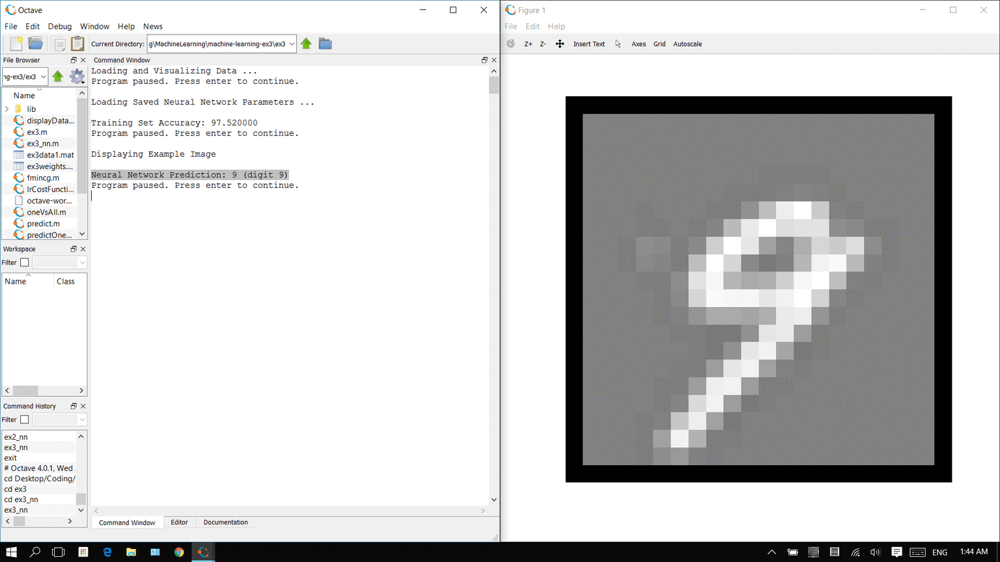

# Hadwriting Recognition
#### Understanding handwritten digits using Matlab  

As part of a programming assigment from [this excellent course](https://www.coursera.org/learn/machine-learning), I used
machine learning techniques to analyze and predict handwritten digits. The specifications of the implementation can be found within
[ex3.pdf](ex3.pdf). Below, you can find a brief summary of what I have accomplished here. All credit for providing the data and building
skeleton code (without which this would have been a **much** harder) goes to the course organizers. 

### Input Specification

There were 5000 training examples of handwritten digits provided. Each training example consisted of a 20 by 20 pixel grayscale image. 
As the data was added to the file, each pixel was "unwrapped" into a row vector, with a floating point number to represent the grayscale
intensity. After combining all 5000 examples, I ended up with a `5000 x 400` input matrix. Since this requires supervised learning,
each row in the vector (each image, really) corresponded to number, indicating its actual value (0 corresponds to 10, so as to not 
conflict with Matlab's indexing system).

### Logistic Regression

The method adopted to learn from the training set was simple multiclass logistic regression with regularization. More specifically,
I used the One vs. All method to isolate each class individually and test them against the rest of the training set. 

By using a vectorized implementation, I was able to determine the cost function and gradient for each individual class (numbered 1
thorugh 10), provided an initial hypothesis. 
These parameters were then passed into a function that adopted a variant of gradient descent that returned the hypothesis parameters
at the minimized cost. 

Finally, by obtaining different hypotheses for each class comparison, I was able to make predictions on the same training set.
The predicted value on a given input was the class that returned the highest probability of being true. On average, predictions were
accurate **94.9%** of the time using this method. 

Feel free to run [ex3.m](ex3/ex3.m) to see all of this in action!

### Neural Networks

In addition to the logistic regression, I was also required to run predictions for the pictures by using a simple neural network 
representation, with one input layer, one hidden layer, and one output layer. In this case, the initial hypotheses at each layer
were in a raw data file. I simply used these inputs to run some Feedforward Propogation on the network. This time, however, the
accuracy of the predictions _increased_ to roughly **97.5%**. This is indicative of the fact that nonlinear hypotheses can often
be used to obtain more consistent results.

Upon running [ex3_nn.m](ex3/ex3_nn.m), you will be able to watch an interactice sequence that displays images from the training set
one at a time and shows the prediction for what the network thinks that digit is. 

